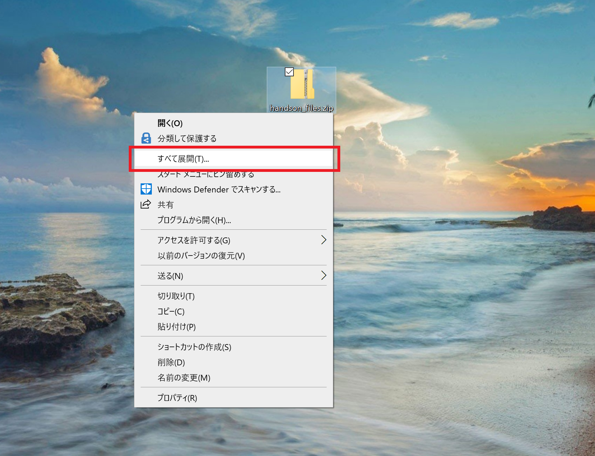
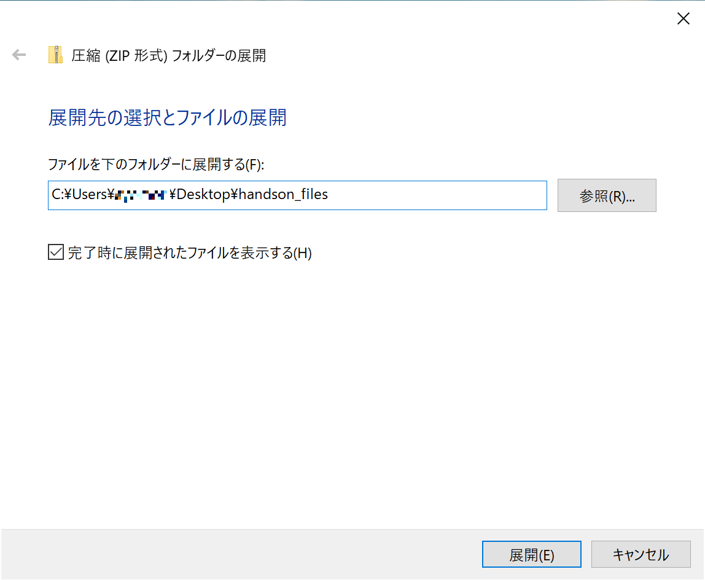

# Microsoft Cognitive Services を利用した 音声⇔テキスト変換サンプル (201907 版)

"人工知能 API" [Microsoft Azure Cognitive Services](https://www.microsoft.com/cognitive-services/) を使うと、音声⇔テキスト変換や翻訳 を行うエンジンをノーコーディングで利用、作成できます。

- [Speech-to-Text](https://azure.microsoft.com/ja-jp/services/cognitive-services/speech-to-text/) : 標準およびカスタム音声や会話の文字起こし
- [Text-to-Speech](https://azure.microsoft.com/ja-jp/services/cognitive-services/text-to-speech/) : 標準およびカスタムのテキスト読み上げ
- [Speech Translation](https://azure.microsoft.com/ja-jp/services/cognitive-services/speech-translation/) : 音声翻訳


# 準備

- Speech Service の API キーとローケーション情報
    - ハンズオンの講師から、Speech Service を利用できる API キーとロケーション情報をお受け取りください。
- サンプルコード一式(ZIP)のダウンロードと展開
    - 以下のリンクを右クリックしてダウンロードします。
    - <a href="speech_samples_files.zip" download="speech_samples_files.zip">speech_samples_files.zip</a> 
    - ダウンロードしたら、右クリックして **[全て展開]** をクリックします。
    - 
    - **圧縮(ZIP形式)フォルダーの展開** のダイアログで **[展開]** をクリックして、展開します。
    - 


# サンプルの利用方法
- Speech-to-Text (C#([UWP](#cuwp)) | [HTML/JavaScript](#htmljavascript))
- Text-to-Speech (C#([Console](#cconsole) | [UWP](#cuwp-1)))

## Speech-to-Text

### C#(UWP)

ダウンロードして展開しておいたディレクトリーにあるサンプルコードを使用していきます。 **SpeechToText\CSharp\CogServicesVisionSamples_201906.sln** をダブルクリックして Visual Studio で開きます。

Visual Studio の画面右側に表示される **ソリューションエクスプローラー** から **MainPage.xaml.cs** をクリックして開きます。

42 行目にある、YOUR_API_KEY と YOUR_LOCATION に Speech Service の情報(APIキー、ロケーション(westus など))を入力します。

```
private async Task SpeechRecognizeAsync()
{
    var config = SpeechConfig.FromSubscription("YOUR_API_KEY", "YOUR_LOCATION");
```

### HTML/JavaScript

ダウンロードして展開しておいたディレクトリーにあるサンプルコードを使用していきます。 
**SpeechToText\JS\index.html** をクリックして起動し、表示される Subscription Key と Region の欄にSpeech Service の情報(APIキー、ロケーション(westus など))を入力して使用します。


## Text-to-Speech

### C#(Console)

ダウンロードして展開しておいたディレクトリーにあるサンプルコードを使用していきます。
**TextToSpeech\CSharp\TextToSpeechConsole_201907\TextToSpeechConsole_201907.sln** をダブルクリックして Visual Studio で開きます。

Visual Studio の画面右側に表示される **ソリューションエクスプローラー** から **Program.cs** をクリックして開きます。

18 行目にある、YOUR_API_KEY と YOUR_LOCATION にご自分のサブスクリプションの情報(APIキー、サービスを作成したロケーション(westus など))を入力します。

```
public static async Task SynthesisToSpeakerAsync()
{
    var config = SpeechConfig.FromSubscription("YOUR_API_KEY", "YOUR_LOCATION");
```

### C#(UWP)

ダウンロードして展開しておいたディレクトリーにあるサンプルコードを使用していきます。 
**TextToSpeech\CSharp\TextToSpeechApp_201907\TextToSpeechApp_201907.sln** をダブルクリックして Visual Studio で開きます。

Visual Studio の画面右側に表示される **ソリューションエクスプローラー** から **MainPage.xaml.cs** をクリックして開きます。

30 行目にある、YOUR_API_KEY と YOUR_LOCATION にSpeech Service の情報(APIキー、ロケーション(westus など))を入力します。

```
private async void SpeakButton_Clicked(object sender, RoutedEventArgs e)
{
    var config = SpeechConfig.FromSubscription("YOUR_API_KEY", "YOUR_LOCATION");
```
